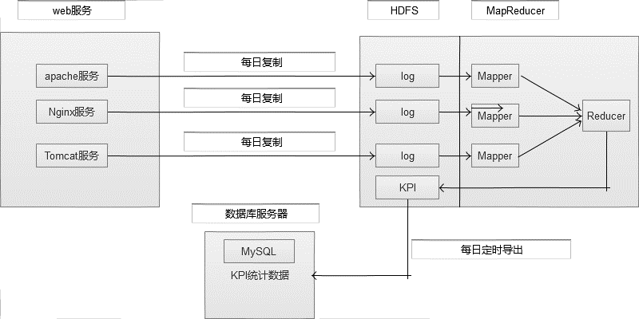
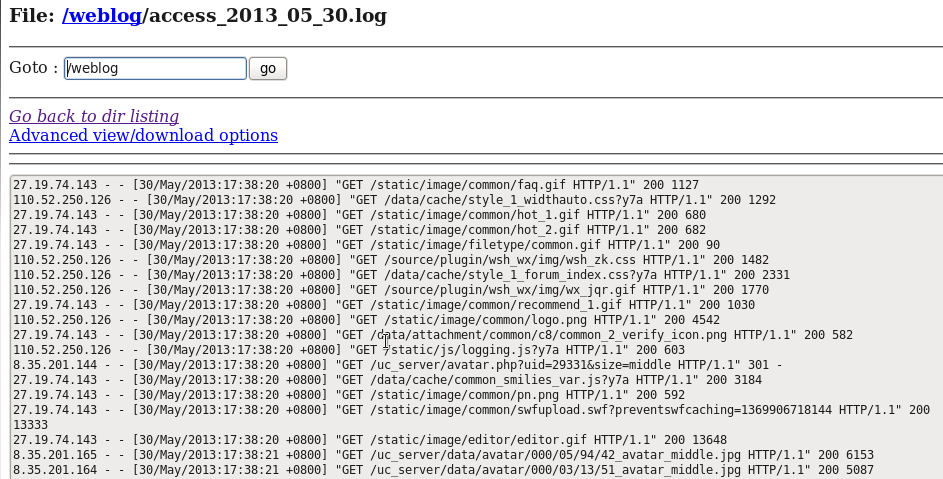
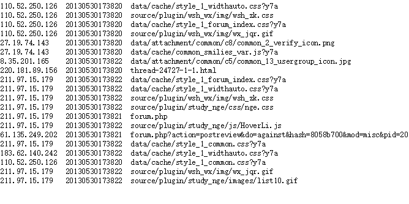
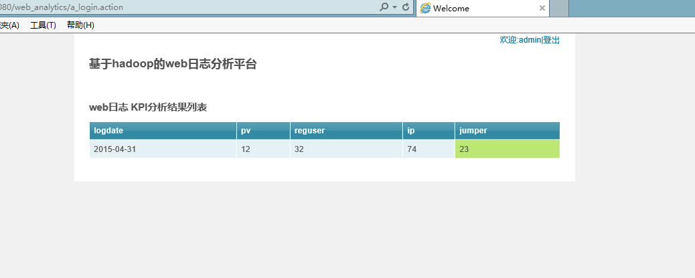

# weblog
基于Hadoop的Web日志分析，包括日志的清洗、日志的统计分析、统计结果的导出、指标数据的Web展示

##主要要分析、统计的指标数据

**浏览量PV**:页面浏览量PV(Page View),是指用户浏览页面的总和，一个独立用户每打开一个页面就被记录一次。网站总流量，可以考核用户对网站的兴趣，就像收视率对电视剧一样。但是对于网站运营者说，更重要的是，每个栏目下的总浏览量。

**访客数UV**（包括新访客数、新访客比例）:访客数（UV）即唯一访客数，一天之内网站的独立访客数(以Cookie为依据)，一天内同一访客多次访问网站只计算1 个访客。在统计工具中，我们经常可以看到，独立访客和IP数的数据是不一样的，独立访客都多于IP数。那是因为，同一个IP地址下，可能有很多台电脑一同使用，这种情况，相信都很常见。还有一种情况就是同一台电脑上，用户清空了缓存，使用360等工具，将cookie删除，这样一段时间后，用户再使用该电脑，进入网站，这样访问数UV也被重新加一。对于网站统计来说，关于访客数需要注意的另一个指标就是新访客数，新访客数据可以衡量网站通过推广活动所获得的用户数量。新访客对于总访客数的比值，可以看到网站吸引新鲜血液的能力以及如何保留旧有用户。

**IP数**：一天之内，访问网站的不同独立IP 个数加和。其中同一IP无论访问了几个页面，独立IP 数均为1。这是我们最熟悉的一个概念，无论同一个IP上有多少电脑，或者其他用户，从某种程度上来说，独立IP的多少，是衡量网站推广活动好坏最直接的数据。

**跳出率**:只浏览了一个页面便离开了网站的访问次数占总的访问次数的百分比，即只浏览了一个页面的访问次数/全部的访问次数汇总。跳出率是非常重要的访客黏性指标，它显示了访客对网站的兴趣程度：跳出率越低说明流量质量越好，访客对网站的内容越感兴趣，这些访客越可能是网站的有效用户、忠实用户。该指标也可以衡量网络营销的效果，指出有多少访客被网络营销吸引到宣传产品页或网站上之后，又流失掉了。比如，网站在某媒体上打广告推广，分析从这个推广来源进入的访客指标，其跳出率可以反映出选择这个媒体是否合适，广告语的撰写是否优秀，以及网站入口页的设计是否用户体验良好。

##系统架构设计

日志是由业务系统产生的，我们可以设置web服务器每天产生一个新的目录，目录下面会产生多个日志文件。设置系统定时器CRON，夜间在0点后，向HDFS导入昨天的日志文件。完成导入后，设置系统定时器，启动MapReduce程序，提取并经过Hive计算统计指标。完成计算后，设置系统定时器，从HDFS导出统计指标数据到MySQL数据库,然后通过web系统将KPI指标直观显示出来，供分析决策使用。

 


                                           架构图

##数据库表结构

Web展示层主要负责的是数据的展现，将最终统计的结果直观的显示出来。其相对简单，主要包括两个模块：用户登录和结果展现。数据库表的设计如下：

Admin 用户登录表：

|字段名|类型|备注|字段描述|
|----|---|---|---|
|userId|int|主键|用户ID| 
|userName|varchar||用户名| 
|passWord|varchar||登录密码|


指标统计结果表：

|字段名|类型|备注|字段描述|
|----|---|---|---|
|logdate|varchar|主键|日志数据的日期|
|pv|int||统计的PV结果|
|reguser|int||统计的UV结果|
|ip|int||统计的IP结果|
|jumper|int||统计的跳出数结果|

##Web日志数据分析流程

基于Hadoop的Web系统的实现针对分布式开发坏境搭建、数据的清洗、数据的统计、数据的存储和数据展现具体的开发流程如下：

(1)分布式集群环境的搭建，模拟hadoop的分布式环境，进行程序的开发，这样我们的程序可以直接部署到真实的物理机器上。

(2)把日志数据上传到HDFS中进行处理。如果是日志服务器数据较小、压力较小，可以直接使用shell命令把数据上传到HDFS中；如果是日志服务器数据较大、压力较大，使用NFS在另一台服务器上上传数据；如果日志服务器非常多、数据量大，使用flume进行数据处理。

日志是在晚上12点左右产生完毕的，假设我们凌晨或者1点去处理昨天的数据。我们需要把日志文件，上传到HDFS里/web_logs目录。使用shell命令把数据从linux磁盘上传到HDFS中，后面清洗的MapReduce程序的数据从HDFS读取。下面是具体的操作：
在HDFS中创建目录，命令如下：$HADOOP_HOME/bin/hadoop fs –mkdir /web_log。然后写一个shell脚本，叫做upload_to_hdfs.sh，内容大体如下:

```
yesterday=`date --date='1 days ago' +%Y_%m_%d`
```

获得昨天的时间并对时间进行格式化。

```
hadoop fs -put  access_${yesterday}.log   /web_log

```

把脚本upload_to_hdfs.sh配置到crontab中，执行命令crontab -e, 写法如下：
  
  ```
    * 1 * * * c
  ```

前5列表示是时间，第一列表示分钟，第二列表示小时，第三列表示日，第四列表示月，第五列表示周。我们希望晚上到1点的时候，自动执行upload_to_hdfs.sh脚本。通过这个脚本就可以每天自动将数据上传到HDFS中。上传之后我们就可以对数据进行清洗。

(3)使用MapReduce对HDFS中的原始数据进行清洗。

使用MapReduce对数据进行清洗，把原始数据处理清洗后，放到hdfs的/weblog _cleaned目录下，每天产生一个子目录。将数据清洗项目代码打成jar包，并将其上传至Linux服务器指定目录下，将自动执行清理的MapReduce程序加入脚本中，于每天1点将日志文件上传到HDFS后，执行数据清洗程序对已存入HDFS的日志文件进行过滤，并将过滤后的数据存入weblog_cleaned目录下。
                    

                                          清洗之前的数据


                                          清洗之后的数据

(4)使用Hive对清洗后的数据进行统计分析。

数据清洗后的结果，是我们接下来要统计的原始数据，我们使用Hive对清洗后的数据进行分区，建立一个外部分区表。清洗后的数据放在HDF中，每天产生一个子目录。分区主要是因为每天产生一个文件夹非常方便，使用分区每次只需要指定日期就可以，不用对所有目录进行全表扫描。下面针对不同的指标进行统计，过程主要如下：

建立一个外部分区表，脚本如下：

```
CREATE EXTERNAL TABLE weblog(ip string, atime string, url string) PARTITIONED BY (logdate string) ROW FORMAT DELIMITED FIELDS TERMINATED BY '\t' LOCATION '/weblog_cleaned'; 
```

增加分区，脚本如下：

```
ALTER TABLE weblog ADD PARTITION(logdate='${yesterday}') LOCATION '/weblog_cleaned/${yesterday}';
```
把代码增加到upload_to_hdfs.sh中，内容如下：

```
hive -e "ALTER TABLE weblog ADD PARTITION(logdate='${yesterday}') LOCATION '/weblog _cleaned/${yesterday}';"
```

**统计每日的pv**：意味着统计总共的行数。页面浏览量即为PV(Page View)，是指所有用户浏览页面的总和，一个独立用户每打开一个页面就被记录1 次。这里，我们只需要统计日志中的记录个数即可，代码如下：

```
CREATE TABLE weblog_pv_${yesterday} AS SELECT COUNT(1) AS PV FROM weblog WHERE logdate='${yesterday}';
```
**统计每日的注册用户数**：该论坛的用户注册页面为member.php，而当用户点击注册时请求的又是member.php?mod=register的url。因此，这里我们只需要统计出日志中访问的URL是member.php?mod=register的即可，代码如下：

```
CREATE TABLE weblog_reguser_${yesterday} AS SELECT COUNT(1) AS REGUSER FROM weblog WHERE logdate='${yesterday}' AND INSTR(url,'member.php?mod=register')>0;
```

**统计每日的独立ip**：一天之内，访问网站的不同独立 IP 个数加和。其中同一IP无论访问了几个页面，独立IP 数均为1。因此，这里我们只需要统计日志中处理的独立IP数即可，在SQL中我们可以通过DISTINCT关键字，在HQL中也是通过这个关键字，代码如下：

```
CREATE TABLE weblog_ip_${yesterday} AS SELECT COUNT(DISTINCT ip) AS IP FROM weblog WHERE logdate='${yesterday}';
```
**统计每日的跳出用户**：只浏览了一个页面便离开了网站的访问次数，即只浏览了一个页面便不再访问的访问次数。这里，我们可以通过用户的IP进行分组，如果分组后的记录数只有一条，那么即为跳出用户，代码如下：

```
CREATE TABLE weblog_jumper_${yesterday} AS SELECT COUNT(1) AS jumper FROM (SELECT COUNT(ip) AS times FROM weblog WHERE logdate='${yesterday}' GROUP BY ip HAVING times=1) e;
```
把每天统计的数据放入一张表，为了方便通过Sqoop统一导出到MySQL，这里我们借助一张汇总表将刚刚统计到的结果整合起来，通过表连接结合：

```
CREATE TABLE weblog_${yesterday} AS SELECT '${yesterday}', a.pv, b.reguser, c.ip, d.jumper FROM weblog_pv_${yesterday} a JOIN weblog_reguser_${yesterday} b ON 1=1 JOIN weblog_ip_${yesterday} c ON 1=1 JOIN weblog_jumper_${yesterday} d ON 1=1 ;
```

注意：因为mysql 不允许远程连接，如何让其远程连接： 授权所有权限在目标表上给root用户（任何地方的root），密码是admin。

```
grant all on hive.* to ‘root’@’%’ identified by ‘admin’;
flush privileges;
```
(5)使用Sqoop把Hive产生的统计结果导出到mysql中。

我们统计完后其结果主要存储在某张Hive表里，为了我们后边Web层的展示，我们需要使用Sqoop工具将Hive里的数据导入到MySQL关系型数据库里。将Hive里的数据导入到mysql里，主要是给应用系统提供数据。下面是导入数据的命令操作：

```
sqoop export --connect jdbc:mysql://hadoop:3306/hmbbs --username root --password admin --table weblog_logs_stat --fields-terminated-by '\001' --export-dir '/hive/weblog_${yesterday}'
```

将统计后的数据导入mysql中之后，要drop掉 Hive里统计使用的历史表，drop掉以后不用的表，减少存储的压力。
delete hive tables

```
hive -e "drop table weblog_${yesterday};"

```

(6)如果用户需要查看详细数据的话，可以使用HBase进行展现。

(7)使用Struts2框架技术开发Web展示界面。

该系统前端主要使用jquery和bootstrap技术，使页面看起来更加美观；后端采用的是Struts2框架结合JDBC技术进行开发。Web系统展示主要包括两个方面:用户登录和统计展示效果如下：


                                      登陆界面


                                   统计结果展示页面
